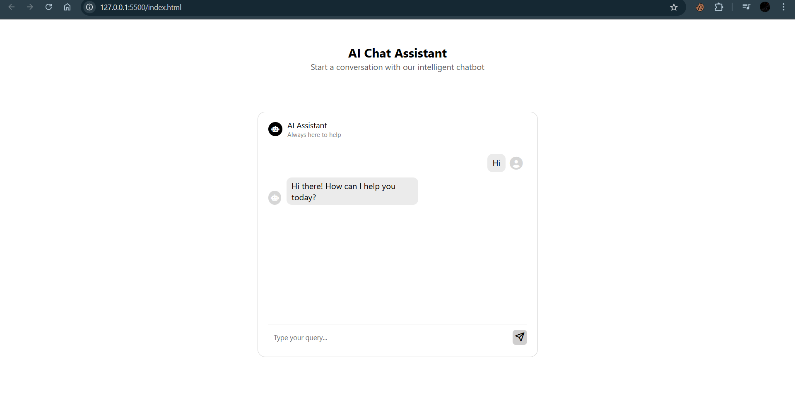

# AI Chat Assistant

  <a href="LICENSE.md"></a>
<p>
  
  
  
  
</p>

A simple and clean front-end for an AI-powered chatbot that connects to the Google Gemini API. This project provides the user interface for interacting with an intelligent assistant, displaying the conversation in a familiar chat format.

## 📸 Screenshots

<p align="center">
  
  <br>
  <em>The main chat interface.</em>
</p>
<p align="center">
  
  <br>
  <em>A sample conversation with the AI assistant.</em>
</p>
 
## ✨ Features

-   Clean and modern user interface.
-   Real-time conversation with Google's Gemini AI.
-   Chat display area for conversation history.
-   User-friendly text input for sending queries.
-   Send messages by clicking the button or pressing `Enter`.
-   Header indicating the bot's status ("Always here to help").

## 🚀 Technologies Used

-   **HTML5:** For the structure and content of the web page.
-   **CSS3:** For styling the application (via `styles.css`).
-   **JavaScript (ES6+):** For handling user input, API communication, and dynamic content.
-   **Google Gemini API:** For generating intelligent and conversational responses.
-   **Font Awesome:** For icons (robot, paper plane).

## 🛠️ Setup and Installation

To run this project locally, follow these simple steps:

1.  **Clone the repository** (or download the files):
    ```sh
    git clone https://github.com/M-Salman-khan/GEMINI_ChatBot
    ```
2.  **Navigate to the project directory**:
    ```sh
    cd GEMINI_ChatBot
    ```
3.  **Configure your API Key** (See the Configuration section below).

4.  **Open `index.html` in your web browser.**

That's it! The application will be running in your browser.

## 🔑 Configuration

This application requires a Google Gemini API key to function.

1.  **Get an API Key**: Visit Google AI Studio to create your free API key.

2.  **Add the Key to the Project**:
    Open the `script.js` file and find the following line:
    ```javascript
    const API_KEY="your_GEMINI_API_KEY"
    ```
    Replace `"your_GEMINI_API_KEY"` with the actual key you obtained from Google AI Studio.

    > **⚠️ Security Warning:** Do not commit your API key to a public repository. For personal or local use, adding it directly to the script is fine. For a production application, you should use environment variables or a secure backend service to handle the API key.

## 📁 File Structure

```
.
├── index.html      # The main HTML file for the chat interface
├── styles.css      # CSS file for all the styling
└── script.js       # JavaScript file for chat logic and interactivity
```

## Usage

1.  Open the `index.html` file in a web browser.
2.  Type your message or question into the input field at the bottom that says "Type your query...".
3.  Click the paper plane icon or press `Enter` (once implemented in `script.js`) to send your message.
4.  The conversation with the AI assistant will be displayed in the chat window.

## 📄 License

This project is open-source and available under the MIT License.